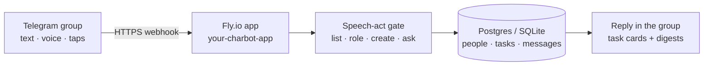
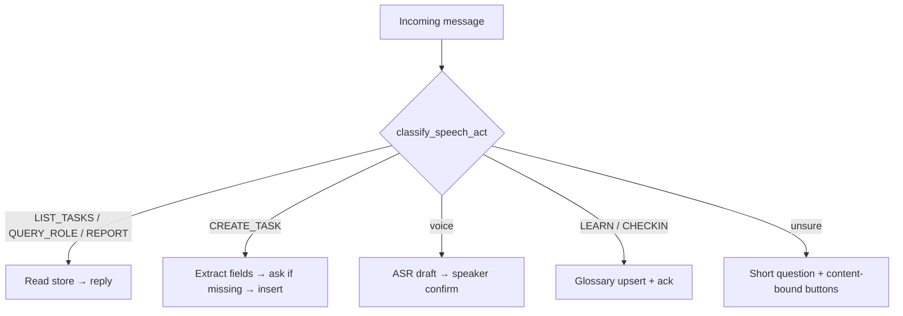
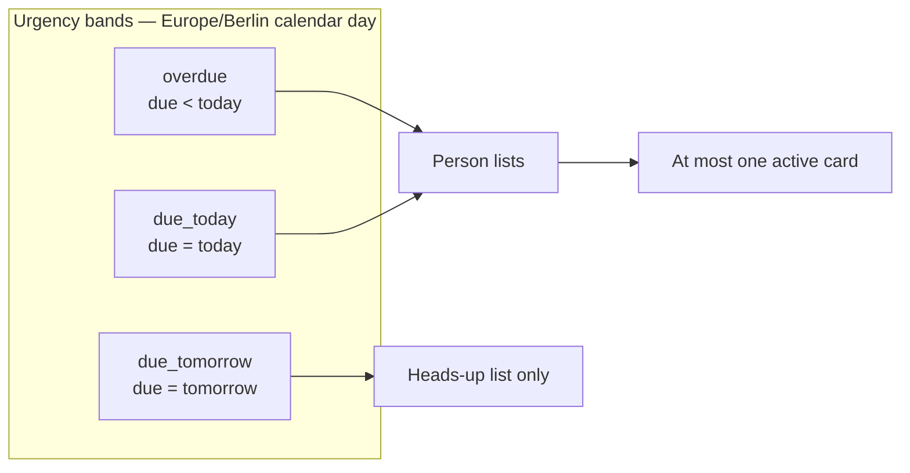
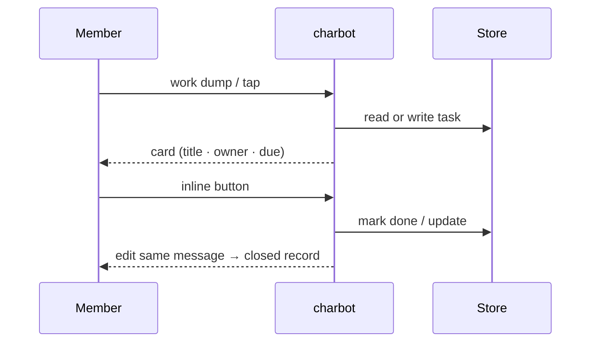

# charbot

Reusable **Telegram coordinator** for small teams. It turns messy group talk (text and voice) into defined work — title, owner, due — stores it, and answers in the same chat with short Persian cards.

This repository ships with **generic Example Org** defaults. Point env vars at your org, group, and Neon/Fly secrets for a live deployment.

Tokens, database URLs, and invite links are **never** stored in this repository.

## Brand visuals

Diagrams and docs graphics use a **khaki / earth** palette (sand, warm cream, deep olive text) — the default Example Org accent. Swap colors in `docs/` assets if you fork for another brand.

## Architecture (overview)









## Quickstart (local)

```bash
python -m venv .venv
source .venv/bin/activate
pip install -e ".[dev]"
cp .env.example .env   # never commit .env
# set TELEGRAM_BOT_TOKEN and TELEGRAM_GROUP_ID
python -m charbot.main --mode polling
```

Do **not** run local polling against the same bot token while a production webhook is registered; Telegram allows one delivery path.

```bash
ruff check charbot tests
pytest
```

## What it does

- Record work as a task: title, owner, deadline; everything else in description
- List open / overdue work as compact cards (no software dumps)
- Remember people (roles, notes, events)
- Classify meaning first: questions about someone’s work **list** that work; they never become a new task
- Transcribe voice over HTTP ASR; speaker must confirm before tasks lock
- Inline buttons generated from the actual question (not a fixed menu)
- Period reports (week / month / date range) from assignee, due, and `completed_at`
- Answer in Persian in Telegram; follow the previous message when someone asks «متوجه شدی؟»

Demo personas (member keys, not Telegram handles): `kawe`, `hamed`, `saman`, `mohammadreza`, `ghazal`. Map real `@usernames` via `CHARBOT_TG_USERNAMES`.

## Configuration

| Variable | Purpose |
|---|---|
| `TELEGRAM_BOT_TOKEN` | Bot API token (secret) |
| `TELEGRAM_GROUP_ID` | Primary allowed group |
| `TELEGRAM_ALLOWED_GROUP_IDS` | Optional extra groups |
| `BOT_MODE` | `polling` (dev) or `webhook` (prod) |
| `WEBHOOK_URL` / `WEBHOOK_PATH` / `WEBHOOK_SECRET` | Webhook surface |
| `DATABASE_URL` | Neon/Postgres; empty → SQLite `DATABASE_PATH` |
| `CHARBOT_ORG_SLUG` / `CHARBOT_ORG_NAME` | Org seed (default `example-org` / `Example Org`) |
| `CHARBOT_GROUP_TITLE` / `CHARBOT_GROUP_CHAT_ID` | Group seed title; optional chat id |
| `CHARBOT_PROJECT_SLUG` / `CHARBOT_PROJECT_NAME` | Default project seed |
| `CHARBOT_TG_USERNAMES` | `key:username,key:username` (empty default) |
| `CHARBOT_ROLE_KAWE` / `CHARBOT_ROLE_HAMED` / `CHARBOT_NOTE_GHAZAL` | Optional role/note seeds |
| `OPENROUTER_API_KEY` / `OPENAI_API_KEY` | ASR (and optional LLM) |

Full example: [`.env.example`](.env.example). Deploy notes: [docs/DEPLOY.md](docs/DEPLOY.md). Security: [docs/SECURITY.md](docs/SECURITY.md).

## Production sketch

Live mode is **webhook**, not polling. Use Fly (or similar) with one always-on machine, Neon for Postgres, and secrets set in the host dashboard — never in git.

```bash
fly deploy --remote-only --app <your-real-app> --ha=false
```

`fly.toml` uses placeholder `app = "your-charbot-app"`. See `fly.toml.example`.

## Docs

| Doc | Audience |
|---|---|
| [docs/FOR-MANAGERS.md](docs/FOR-MANAGERS.md) | How to talk to the bot |
| [docs/ARCHITECTURE.md](docs/ARCHITECTURE.md) | System map for engineers |
| [docs/UI-GUIDELINES.md](docs/UI-GUIDELINES.md) | Telegram cards, lists, keyboards |
| [docs/SECURITY.md](docs/SECURITY.md) | Secrets, gating, redaction |
| [docs/DEPLOY.md](docs/DEPLOY.md) | Fly / Neon / webhook |

## Security (short)

- Never commit `.env`, Fly tokens, BotFather tokens, or group invites
- Restrict the bot with `TELEGRAM_GROUP_ID`
- Use `WEBHOOK_SECRET` so only Telegram can POST to the webhook
- Logs must not print tokens (redact `bot<id>:<secret>`)
