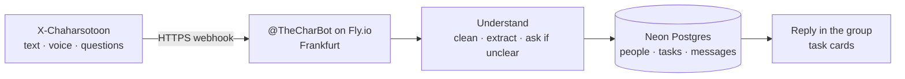

# charbot

Telegram coordinator for **Chaharsotoon** (چهارستون). It keeps board work defined, assigned, due, and visible in the company group **X-Chaharsotoon**.

| | |
|---|---|
| Bot | [@TheCharBot](https://t.me/TheCharBot) |
| Production | [chaharsotoon-charbot.fly.dev](https://chaharsotoon-charbot.fly.dev/health) (Fly.io, Frankfurt, webhook) |
| Data | Neon Postgres (`identity`, `work`, `comms`, `ops`) |
| Group | X-Chaharsotoon (restricted by `TELEGRAM_GROUP_ID`) |

Tokens, database URLs, and invite links are **never** stored in this repository.

## How it works (for everyone)

Board members talk in Telegram the way they already talk. charbot listens, turns messy speech into a precise record, stores it, and answers in the group.


1. Someone writes, sends a voice note, or asks a question in the group.
2. Telegram delivers that update to Fly over HTTPS (`POST /telegram/webhook`).
3. charbot interprets **meaning**, not only keywords: it strips filler, fills title / owner / due / description, and **asks** when something is missing instead of guessing.
4. People, roles, tasks, and messages are stored in Neon.
5. The bot replies in the group. Task lists show only **title, owner, due**. Extra detail stays on the record.



A longer, manager-facing write-up is in [docs/FOR-MANAGERS.md](docs/FOR-MANAGERS.md). Engineers: [docs/ARCHITECTURE.md](docs/ARCHITECTURE.md).

## What it does

- Record work as a task: title, owner, deadline; everything else in description
- List open / overdue work as compact cards (no software dumps)
- Remember each person (role, notes, events) — Hamed and Saman roles are already stored and are not re-asked
- Transcribe voice (local/dev pipeline; Fly image is webhook-only and does not bundle Whisper)
- Answer in Persian in Telegram; follow the previous message when someone asks «متوجه شدی؟»
- Weekday backup checks (does **not** steal Telegram `getUpdates` from the live webhook)

Board: Kawe (chair, Berlin), Hamed (CEO / design), Saman (vice chair, execution & ops), Mohammadreza (internal accounting). Ghazal is staff (marketing / branding / design), not board.

## Production

Live mode is **webhook**, not polling.

| Piece | Where |
|---|---|
| Process | Fly app `chaharsotoon-charbot`, region `fra`, one always-on machine |
| Health | `GET https://chaharsotoon-charbot.fly.dev/health` |
| Webhook | `POST /telegram/webhook` (optional `WEBHOOK_SECRET`) |
| Database | Neon; `DATABASE_URL` is a Fly secret |
| Bot token | Fly secret `TELEGRAM_BOT_TOKEN` |

Deploy (maintainers):

```bash
fly deploy --remote-only --app chaharsotoon-charbot --ha=false
```

Set or rotate secrets without printing them into git:

```bash
fly secrets set TELEGRAM_BOT_TOKEN=... DATABASE_URL=... TELEGRAM_GROUP_ID=... \
  WEBHOOK_URL=https://chaharsotoon-charbot.fly.dev WEBHOOK_SECRET=... \
  --app chaharsotoon-charbot
```

Org Deploy Token is enough to create the app. After the app exists, a narrower App Deploy Token is preferred for CI.

## Local development

```bash
python -m venv .venv
source .venv/bin/activate
pip install -e ".[dev]"
cp .env.example .env   # never commit .env
python -m charbot.main --mode polling
```

Do **not** run local polling against the same bot token while the Fly webhook is registered; Telegram allows one delivery path.

```bash
ruff check charbot tests
pytest
```

## Security

- Never commit `.env`, Fly tokens, BotFather tokens, or the group invite
- Restrict the bot with `TELEGRAM_GROUP_ID`
- Use `WEBHOOK_SECRET` so only Telegram can POST to the webhook
- Logs must not print tokens (redact `bot<id>:<secret>`)
