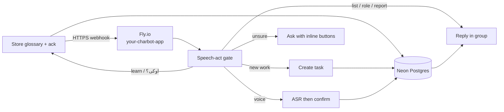
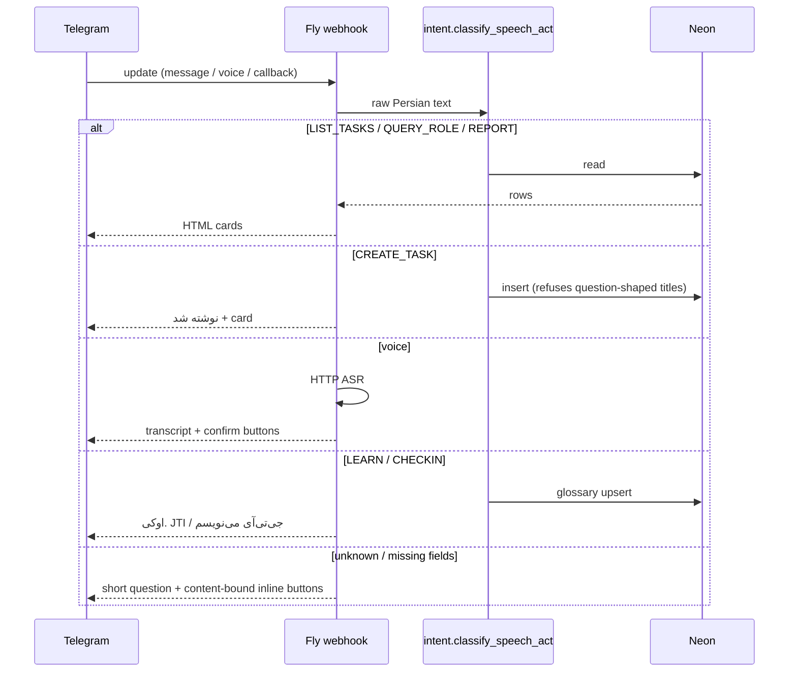

# Architecture

charbot is a reusable Telegram coordinator for a small team (**Example Org** by default). A typical production setup is a single Fly.io machine (e.g. Frankfurt) that receives Telegram webhooks and stores everything in Neon Postgres.

This document is the technical map. Keep it in sync with the code on every change. Manager-facing picture: [FOR-MANAGERS.md](FOR-MANAGERS.md). Workflow image: [charbot-workflow.png](charbot-workflow.png). Telegram presentation rules (cards, lists, digests, keyboards): [UI-GUIDELINES.md](UI-GUIDELINES.md).

## 1. High level

**Invariant:** a question about existing work is never a new task. Classification happens *before* extract/create. The database refuses leftover titles such as `های سامان چی`.

## 2. Runtime

| Piece | Value |
|---|---|
| App | placeholder `your-charbot-app` in `fly.toml`; deploy with `--app <real>` |
| Region | `fra` (Frankfurt) |
| Mode | `BOT_MODE=webhook` |
| Process | `min_machines_running = 1`, `auto_stop_machines = false` |
| Health | `GET /health` → `{"status":"ok","service":"charbot"}` |
| Webhook | `POST /telegram/webhook` |
| Entry | `charbot.main` (FastAPI + python-telegram-bot) |
| Group | Configured group(s), gated by `TELEGRAM_GROUP_ID` |

Startup registers the webhook and **must not** drop pending updates. Polling (`python -m charbot.main --mode polling`) is local/dev only. Never call Telegram `getUpdates` against the production token while the webhook is live.

## 3. Components (code)

| Module | Role |
|---|---|
| `charbot/main.py` | FastAPI app, webhook, health, log redaction |
| `charbot/bot.py` | Telegram handlers, follow-up, voice confirm, buttons |
| `charbot/intent.py` | **Speech-act gate** — list vs role vs create vs report |
| `charbot/nlp.py` | Dates, slash commands, `parse_natural_language` (uses the gate first) |
| `charbot/understand.py` | Colloquial extract: title / owner / due / description, ask if unsure |
| `charbot/voice.py` | Download, HTTP ASR backends, draft transcript, speaker confirm |
| `charbot/buttons.py` | Keyboards: 2–4 inline buttons generated from *this* question's content |
| `charbot/report.py` | Period performance: done / open / overdue per person |
| `charbot/store.py` | Neon/SQLite; last-line refuse of question-shaped titles |
| `charbot/formatting.py` | Presentation layer: cards, read-only lists, grouped digests, active-card and resolved-edit text, Persian digits + Jalali dates |
| `charbot/members.py` | Board/staff identity, name matching |

**Presentation invariant:** `charbot/formatting.py` (text/layout) and
`charbot/buttons.py` (keyboards) are the *only* places that render a task,
list, digest, or build an `InlineKeyboardMarkup`. `bot.py` and `report.py`
call into them; no other module may lay out its own text shape or
construct its own ad-hoc keyboard. Full rules and rendered examples of
every message type: [UI-GUIDELINES.md](UI-GUIDELINES.md).

## 4. Speech-act gate (do not bypass)

`classify_speech_act(text)` is the only writer of intent. Callers: `parse_natural_language`, `handle_natural_language`, voice lock, follow-up create.

| Meaning | Kind | Example |
|---|---|---|
| Inventory of work | `LIST_TASKS` | `کارهای سامان چی؟` `کارهای من چی بودن؟` |
| Board open list | `LIST_TASKS` board_open | `کارهای باز` |
| Job title | `QUERY_ROLE` | `نقش حامد چیه؟` (and **not** if `کارها` is present) |
| Period report | `REPORT` | `گزارش این هفته` |
| Completion of existing work | `REPORT_DONE` | `کارم تموم شد` `انجام دادم و فرستادم` |
| New work imperative | `CREATE_TASK` | `قرارداد حامد را تا فردا بررسی کن` |
| Ambiguous «چیکار می‌کنه» | `ASK_WHICH` | buttons: کارهاش / نقشش |

**Agency:** directed speech in the allowed group never goes silent. `must_reply()` is true for questions, teaching, and check-ins (`اوکی؟` = did you get it). No `@mention` required. Short bare `اوکی` still confirms a pending voice transcript.

Defense in depth:

1. Classifier runs **before** `extract_task`.
2. `may_create_task()` must be true for any insert path.
3. `store.create_task` raises if the title looks like a stripped question (`های …`, `؟`, inventory morphology).
4. Tests in `tests/test_intent.py` (table, not one sentence).

A named person in a question is **not** a role dump. `کارهای حامد` lists Hamed’s tasks.

## 4b. Colleague loop (agency)

Directed speech uses a small in-process loop, not an MCP server and not a phone stack:

Perceive → **policy gate** (`classify_speech_act`) → **allowlisted tools** (`reply`, `learn_glossary`, `ask`) → Respond.

- `اوکی؟` after teaching is a check-in (did you get it?), not a voice-transcript yes.
- Tools cannot create tasks. `may_create_task` remains the only insert path.
- `REPORT_DONE` / completion reports (تموم شد، انجام دادم، تحویل شد، فرستادم، گزارش کار) never create tasks. They match the speaker's open work and call `store.mark_done`. A pending create draft waiting for owner/due is cancelled.
- LLM (OpenRouter, optional, 8s timeout) may pick a tool; output is JSON data, never executed as code. If the LLM is down, heuristics still reply. Silence is a class bug.
- Writes the user explicitly taught (a name) are applied and open titles are rewritten. Task writes stay behind existing confirmations.

## 5. Voice and ASR models

Fly **does not** install `faster-whisper` (image size / health checks). Transcription is HTTP.

Preference order (`charbot/voice.py` `asr_backends()`):

| Order | When | Endpoint | Model | Why |
|---|---|---|---|---|
| 1 | `OPENROUTER_API_KEY` | `https://openrouter.ai/api/v1/audio/transcriptions` | `deepgram/nova-3` | Dedicated Persian (`language=fa`), ~$0.0043/min |
| 2 | same key | same | `openai/whisper-large-v3` | Cheap multilingual fallback (~$0.0005/min via OpenRouter) |
| 3 | `OPENAI_API_KEY` | `https://api.openai.com/v1/audio/transcriptions` | `gpt-4o-mini-transcribe` | Last resort on the existing OpenAI key |

Always send `language=fa`. Whisper-family calls also send a glossary prompt (org/project glossary defaults, **JTI/جی‌تی‌آی**, names, airports). `GTI` is an alias of JTI, not a name. Deepgram rejects that prompt field, so it is omitted for Nova-3.

Override first OpenRouter slug with `CHARBOT_ASR_MODEL` only when it contains `/` (full OpenRouter id).

**Product rule:** ASR text is a draft. Reply to the speaker with the full transcript in `<blockquote>`, content-bound buttons («همین بود» / «این را اصلاح می‌کنم»). Wrong user tapping confirm is rejected. Tasks are created only after confirm.

Voice work is `asyncio.create_task` so `/health` is not blocked.

## 6. Data (Neon)

Schemas (`schema.sql`):

| Schema | Contents |
|---|---|
| `identity` | organizations, groups, people, roles, memories, events |
| `work` | projects (default demo project), tasks, assignees, task events (`completed_at` on done) |
| `comms` | messages, message_media, lessons |
| `ops` | settings, migrations |

`search_path`: `identity, work, comms, ops, public`. Assignee is `work.task_assignees` + `identity.people.slug`, not a column on `tasks`.

Period reports (`charbot/report.py`) count per person: done / still open / overdue, from assignee + due + `completed_at`, Europe/Berlin timezone. Weekly digest: Friday 12:00 Europe/Berlin.

## 7. UX

- Telegram group: short natural Persian. Real `@mentions`. No `گرفتم ثبت شد`.
- Presentation model (full contract: [UI-GUIDELINES.md](UI-GUIDELINES.md)):
  **lists explain; cards ask; edits close the loop.** A read-only list
  (morning plan, `/open`, `/overdue`, reports, «کارهای X») never carries a
  keyboard. Exactly one answerable item gets exactly one message with one
  keyboard — never several tasks' buttons stacked under one message. On
  tap, that message is *edited* into a resolved record; the next pending
  item (if any) is sent as a fresh card, one at a time.
- Task cards: bold title, then one natural Persian line — ring + owner
  name + Jalali due date. Persian digits throughout, no bare `#id`.
- Questions to humans: inline buttons generated from **that** question, not a frozen global menu. Tap completes; free text is for corrections.
- Hamed and Saman roles are stored; never re-ask.

## 8. Org / identity env (public defaults)

| Name | Default | Notes |
|---|---|---|
| `CHARBOT_ORG_SLUG` | `example-org` | Must match existing Neon org slug in production |
| `CHARBOT_ORG_NAME` | `Example Org` | Display / seed name |
| `CHARBOT_GROUP_TITLE` | `Example Board` | Group seed title |
| `CHARBOT_GROUP_CHAT_ID` | _(empty)_ | Optional; when set, Postgres seed/upsert uses this chat id |
| `CHARBOT_PROJECT_SLUG` / `NAME` | `demo-project` / `Demo Project` | Default project seed |
| `CHARBOT_TG_USERNAMES` | _(empty)_ | `key:username,…` for @mentions fallback |
| `CHARBOT_ROLE_*` / `CHARBOT_NOTE_GHAZAL` | generic English | Optional role/note seeds |

Changing the default slug does **not** wipe Neon rows; the app simply ensures/upserts under the configured slug. Production must set the historical slug to keep live data in view.

## 9. Secrets (never git)

| Name | Use |
|---|---|
| `TELEGRAM_BOT_TOKEN` | Bot API |
| `DATABASE_URL` | Neon |
| `WEBHOOK_SECRET` | Telegram webhook header |
| `TELEGRAM_GROUP_ID` | Allowed group |
| `OPENROUTER_API_KEY` | Preferred ASR (+ future routed models) |
| `OPENAI_API_KEY` | ASR last fallback / optional LLM extract |
| `CHARBOT_ASR_MODEL` | Optional OpenRouter slug override |
| `FLY_API_TOKEN` | Deploy only, operator machine |

`.dockerignore` excludes `.venv`, `.git`, `.env`, `data/`.

## 10. Backup (Grok routines)

Weekday inbox / morning / afternoon / Friday report. They may read Neon. They must **never** call Telegram `getUpdates`.

## 11. Scheduled jobs

The external scheduler invokes the package entrypoints (from `/workspace/charbot-app` with the project environment; prefer `TZ=Europe/Berlin` so `date.today()` matches the Berlin calendar day):

- Morning plan: `PYTHONPATH=/workspace/charbot-app .venv/bin/python -m charbot.jobs.standup`
- Urgency follow-up: `PYTHONPATH=/workspace/charbot-app .venv/bin/python -m charbot.jobs.urgency` (default `--dry-run`; pass `--no-dry-run` only for a live send)
- Afternoon follow-up: `PYTHONPATH=/workspace/charbot-app .venv/bin/python -m charbot.jobs.followup`
- Inbox sweep: `PYTHONPATH=/workspace/charbot-app .venv/bin/python -m charbot.jobs.inbox`
- Weekly report (Friday noon Berlin): `PYTHONPATH=/workspace/charbot-app .venv/bin/python -m charbot.jobs.weekly_report`

### Urgency job (`charbot.jobs.urgency`)

Separate surface from the general afternoon follow-up. Three absolute bands by Berlin calendar day (`today` injectable for tests):

| Mode | Label | Rule | Active card? |
|---|---|---|---|
| `overdue` | عقب‌افتاده | `due_date < today` | yes |
| `due_today` | موعد امروز | `due_date == today` | yes |
| `due_tomorrow` | موعد فردا | `due_date == tomorrow` | list only |

Per non-empty band: intro (`N کار برای M نفر`) then one read-only person message via `format_person_list_messages`. Bands are never merged into one «فوری» digest. After lists: at most **one** active card in flight (oldest overdue person-first, then due today); remainder shares `followup_queue` with `charbot.jobs.followup`. Ghazal cards address Hamed in the question (`حامد، از غزل بپرس: …`). CLI: `--modes overdue,due_today` / `CHARBOT_URGENCY_MODES`, `--max-cards`, `--today YYYY-MM-DD`. Default is dry-run (prints HTML); never print secrets.

**Recommended weekday Berlin cadence** (document for Grok routines — do not rewrite routines in this change):

- overdue (+ due today): ~10:00, 13:30, 16:30, 18:30
- tomorrow heads-up: once with the 16:30 or 18:30 run (`--modes` including `due_tomorrow`)
- Quiet hours: weekday working hours only

Every scheduled outbound message is rendered by `charbot.formatting`, `charbot.report`, and `charbot.buttons`, the same presentation layer used by live replies. Jobs use `TaskStore` for Neon/SQLite persistence and never call Telegram `getUpdates`.
