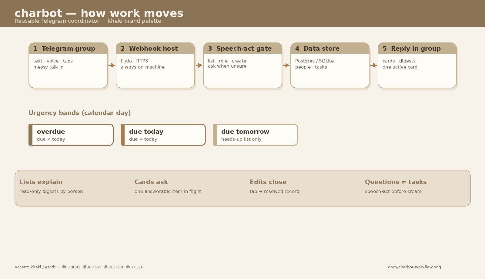
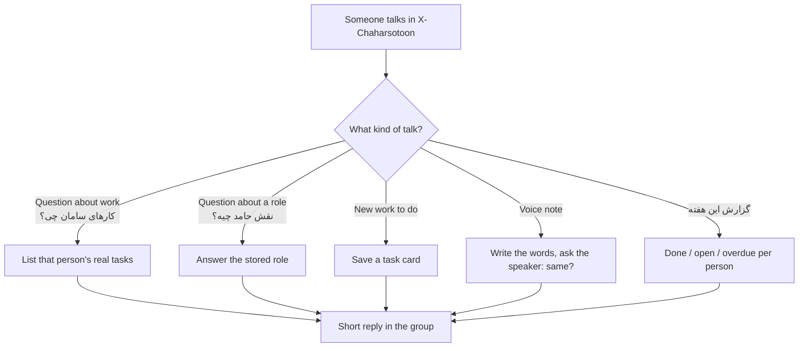

# charbot for managers

This is the coordination bot for Chaharsotoon. It lives in the Telegram group **X-Chaharsotoon** as **@TheCharBot**. You do not need to know how servers work to use it.

## The idea in one sentence

Talk in the group as usual. The bot turns that talk into a clean work record (what, who, when) and answers in the same group.

## Picture of the service

| Step | What you see | What actually happens |
|---|---|---|
| 1 | Someone speaks or writes in X-Chaharsotoon | Telegram sends the message to our bot |
| 2 | The bot is always on | A small Fly.io machine in Frankfurt receives it immediately (webhook) |
| 3 | The bot understands messy speech | It decides **meaning first**: listing work, asking a role, or creating new work. Questions never become a new task |
| 4 | Voice is checked with the speaker | It shows the generated text and waits for a tap («همین بود») before locking tasks |
| 5 | Nothing important is lost | People, roles, tasks, and messages sit in Neon (hosted Postgres) |
| 6 | A short card comes back | Lists show **title · owner · due** only |

## How to talk to it

- Ordinary Persian is enough. Slash commands are optional.
- «کارهای سامان چی؟» lists Saman’s open work. It must **not** open a new task titled «های سامان چی».
- «نقش حامد چیه؟» is the job title. «کارهای حامد» is his task list. Those are different questions.
- After a voice note, only the speaker confirms or edits the transcript.
- Buttons under a question belong to **that** question. Tap to finish; type only to correct.
- If you describe work and then ask “did you get that?”, it should use the **previous** message.
- It will not keep asking Hamed or Saman for their titles. Those are already recorded.
- Company name is **چهارستون** (Chaharsotoon).
- Friday noon: a weekly per-person completion report in the group.

## What a task is

1. **Title** — the work, cleaned
2. **Owner** — who is responsible
3. **Deadline** — when it is due
4. **Description** — everything else

If owner or deadline is missing, the bot should ask. It should not silently drop the work. It should not invent a task from a question.

## What this is not

- Not a replacement for the board. It is the board’s memory in the group.
- Not running on anyone’s laptop in production.
- Not storing secrets in GitHub.

## When something looks “deaf”

Telegram delivers to **one** live process. Production is the Fly webhook. A laptop poller must stay off. Health: [https://chaharsotoon-charbot.fly.dev/health](https://chaharsotoon-charbot.fly.dev/health) should return `ok`.
